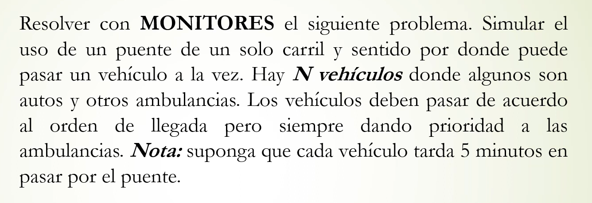

````c
process vehiculo [id:1..N]{
	text tipo;
	get_tipo(tipo);
	Espera.esperar(id,tipo);
	--pasar_puente(); 
	Espera.avisarSalida();
}

Monitor Espera{
	cond espera [N];
	colaPrioridad cola;
	bool libre=true;
	int id_aux;
	
	procedure esperar(in int id, in text tipo);
		if (!libre){
			push_prioridadAmbulancia(cola(id,tipo));
			wait(espera[id]);
		libre=false;
		
	procedure avisarSalida();
		if (cola.isempty()){
			libre=true;
		}	
		else {
			pop(cola(id_aux));
			signal(espera[id_aux]);
		}
	
}


````
