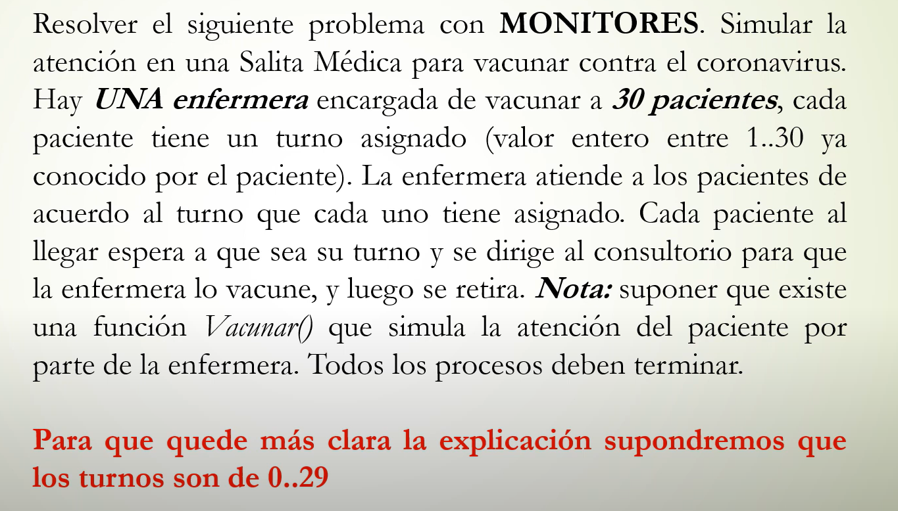

````c
process Enfermera {
	for i := 1 to 30 {
		Sala.esperar_paciente();
		Vacunatorio.vacunar_paciente();
	}
}

process Paciente [id: 1..30]{
	int turno;
	get_turno(turno);
	Sala.esperar_turno(id,turno);
	Vacunatorio.vacunarse();
}

Monitor Sala {
	cond espera_paciente [30];
	colaPrioridad cola;
	int turno_actual = 1;
	bool turnos [30] = ([30], false);

	procedure esperar_turno (in int id, in int turno){
		turnos[turno]=true;
		if (turno==turno_actual){
			signal(espera_enfermera);
			turno_actual++;
		} 
		wait(espera_paciente[id]);
	}
	
	procedure esperar_paciente(){
		if (!turnos[turno_actual]){
			wait(espera_enfermera);
		}
		signal(esperando_paciente[turno_actual])	
	}
}

Monitor Vacunatorio {
	cond estoy=false;
	enfermera_lista=false;
	int paciente_aVacunar;

	procedure vacunarse (in int id){
		llego_paciente=true;
		signal(enfermera_esperando);
		paciente_aVacunara=(id);
		wait(espera_paciente);
		signal(paciente_seva);
	}
	
	procedure vacunar_paciente(){
		if (!llego_paciente){
			wait(enfermera_esperando);
		}
		Vacunar(paciente_aVacunar);
		signal(espera_paciente);
		wait(paciente_seva);
	}

}

````

