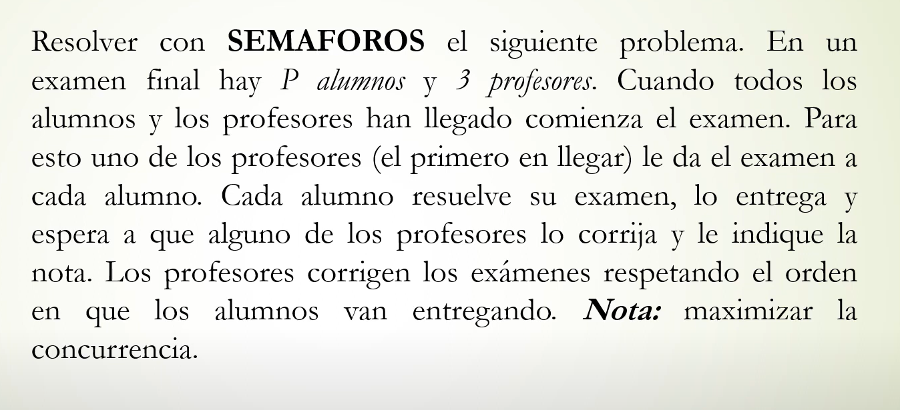

````c
sem mutexLlegada = 1;
sem espera_examen [P] = ([P], 0);
sem despertarPrimerProfesor = 0;

process Alumno [id:1..P]{
	P(mutexLlegada);
	cant++;
	if (cant==P+3){
		V(despertarPrimerProfesor);
	}
	V(mutexLlegada);
	P(espera_examen[id]);
	hacer_examen();
	P(mutexCola);
	push(c(id));
	V(mutexCola);
	V(hayExamen);
	P(nota[id]);
}

process Profesor [id:1..3]{
	int id_aux;
	P(mutex_pro);
	cant_profe++;
	if (cant_profe == 1){
		primer_profe=id;
	}
	V(mutex_pro)
	P(mutexLlegada);
	cant++;
	if (cant==P+3){
		V(despertarPrimerProfe);
	}
	if (primer_profe==id){
		P(mutexLlegada);
		P(despertarPrimerProfe);
	}
	V(mutexLlegada);
	while(true){
		P(hayExamen);
		P(mutexCola);
		pop(c(id_aux));
		V(mutexCola);
		corregir(nota[id_aux]);
		V(nota[id_aux]);
	}
}


````
