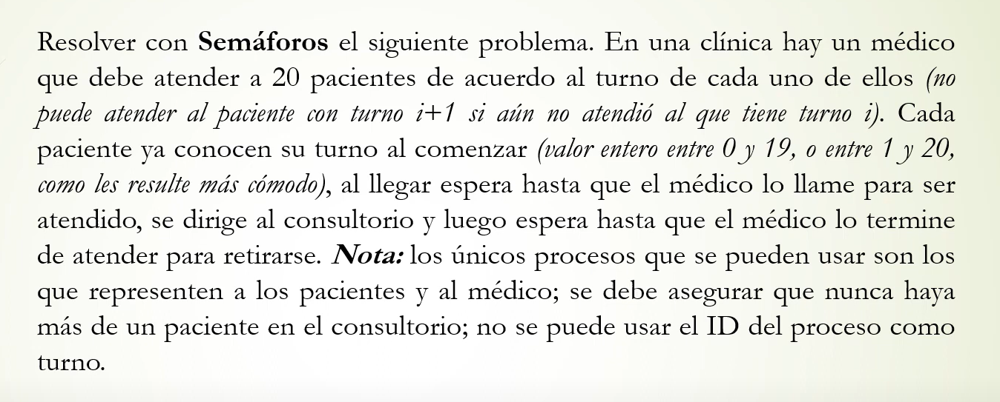

````c
sem turnos[20] = 0;
sem pasar_alConsultorio = 0;
sem vacunado = 0;
sem retirarse = 0;


process Paciente [id:1..20]{
	int turno;
	turno=get_turno();
	P(turnos[turno]);
	V(pasar_alConsultorio);
	P(vacunado);
	V(retirarse);
}

process medico {
	for i := 1 to 20{
		V(turnos[i]);
		P(pasar_alConsultorio);
		-- vacunar
		V(vacunado);
		P(retirarse);
	}

}


`````
